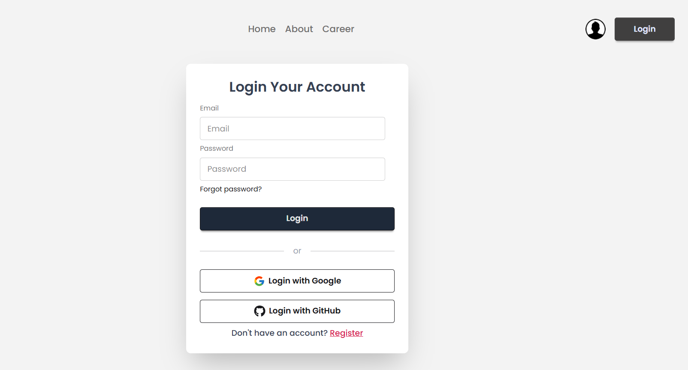

# 🐉 The Dragon News

**The Dragon News** is a modern, responsive, and category-based news portal built with **React**, powered by **Firebase Authentication**, and styled using **Tailwind CSS**.  
It displays breaking news on the homepage, with categorized news browsing and detailed article views through dynamic routing.

---

## 🌍 Live Demo

[🔗👉 Visit The Dragon News](https://the-dragon-news11.netlify.app/category/1)

---

## 🚀 Features

- 📰 **Breaking News Section** — Displays top breaking news as soon as you enter the site.  
- 📂 **Category-wise News** — Browse news by specific categories.  
- 📖 **News Details Page** — View complete details of any news by clicking the **“Read More”** button.  
- 🔐 **User Authentication** — Users can:
  - Register using email and password  
  - Log in using **Email & Password**, **Google**, or **GitHub**  
  - Log out easily from the navigation bar  
- 🔒 **Private Routes** — Some pages are protected and accessible only after login.  
- ⚡ **Responsive Design** — Fully optimized for mobile, tablet, and desktop devices.  
- 🪄 **Modern UI/UX** — Smooth interactions and consistent design with TailwindCSS.  
- 🕒 **Date Display** — News timestamps formatted using **date-fns**.  
- 🔔 **Toast Notifications** — For successful login, logout, registration, and errors.

---

## 🧰 Technologies Used

| Category | Technologies |
|-----------|---------------|
| **Frontend** | React, React DOM, React Router, React Router DOM |
| **Styling** | Tailwind CSS, Lucide React, React Icons |
| **State & UI Enhancements** | React Fast Marquee, React Toastify |
| **Authentication** | Firebase Authentication |
| **Utilities** | date-fns |
| **Build Tool** | Vite |

---
## 📸 Screenshots

### 🏠 Homepage


### 📰 News Details Page


### 🔐 Login Page


---

## 🧭 Project Structure

```
The-Dragon-News/
│
├── public/
│   └── assets/
│
├── src/
│   ├── components/
│   ├── pages/
│   ├── routes/
│   ├── firebase/
│   ├── hooks/
│   ├── App.jsx
│   ├── main.jsx
│   └── index.css
│
├── .gitignore
├── package.json
├── tailwind.config.js
├── vite.config.js
└── README.md
```

---

## 🔧 Installation & Setup

1. **Clone the repository:**
   ```bash
   git clone https://github.com/yourusername/the-dragon-news.git
   cd the-dragon-news
   ```

2. **Install dependencies:**
   ```bash
   npm install
   ```

3. **Set up Firebase:**
   - Go to [Firebase Console](https://console.firebase.google.com/)
   - Create a new project and enable **Email/Password**, **Google**, and **GitHub** providers.
   - Add your Firebase config inside a `.env.local` file:
     ```
     VITE_apiKey=your_api_key
     VITE_authDomain=your_auth_domain
     VITE_projectId=your_project_id
     VITE_storageBucket=your_storage_bucket
     VITE_messagingSenderId=your_messaging_sender_id
     VITE_appId=your_app_id
     ```

4. **Start the development server:**
   ```bash
   npm run dev
   ```

5. **Build for production:**
   ```bash
   npm run build
   ```

---

## 🔒 Authentication Flow

| Action | Description |
|--------|--------------|
| **Register** | User creates an account using email and password |
| **Login** | Authenticated using Firebase Auth |
| **Social Login** | Supports Google & GitHub sign-in |
| **Protected Routes** | Certain routes require authentication |
| **Logout** | User can securely sign out |

---

## 📁 Environment Variables

Create a `.env.local` file in the root directory and include:

```bash
VITE_apiKey=
VITE_authDomain=
VITE_projectId=
VITE_storageBucket=
VITE_messagingSenderId=
VITE_appId=
```

---

## 🧠 Key Dependencies

```json
"dependencies": {
  "@tailwindcss/vite": "^4.1.14",
  "date-fns": "^4.1.0",
  "firebase": "^12.4.0",
  "lucide-react": "^0.546.0",
  "react": "^19.1.1",
  "react-dom": "^19.1.1",
  "react-fast-marquee": "^1.6.5",
  "react-icons": "^5.5.0",
  "react-router": "^7.9.4",
  "react-router-dom": "^7.9.4",
  "react-toastify": "^11.0.5",
  "tailwindcss": "^4.1.14"
}
```
---
